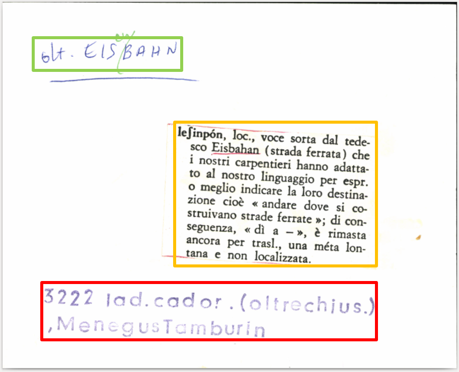
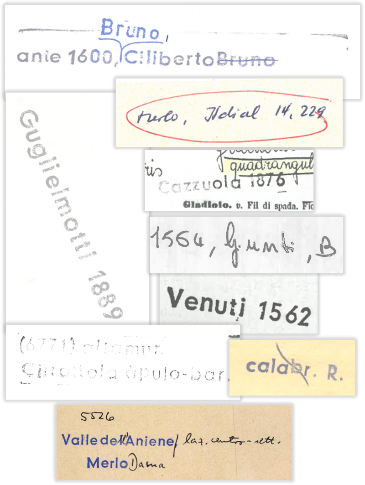

# LEI — Stamp Detection and Recognition Datasets

[](https://doi.org/10.1093/ijl/ecag001)

Three datasets built from the scanned index cards of the *Lessico Etimologico Italiano* (LEI),
released with the paper:

> **Deep Learning for Textual Stamp Recognition on Index Cards of the Lessico Etimologico Italiano**
> Korfhage et al. (2026), *International Journal of Lexicography* 39, ecag001.
> [https://doi.org/10.1093/ijl/ecag001](https://doi.org/10.1093/ijl/ecag001)

<p align="center">
  
</p>
<p align="center">
  <sub>An index card with the three annotated classes: etymon (green), content (orange), stamp (red).</sub>
</p>

## Overview

| Dataset | Task | Size | Download |
| --- | --- | --- | --- |
| [LEI-Detection](#lei-detection) | Detection of stamp, etymon, content | 27,732 instances | [detection_dataset.zip](https://zenodo.org/records/22788319/files/detection_dataset.zip?download=1) |
| [LEI-Stamps](#lei-stamps) | Stamp recognition, 3,817 classes | 170,400 images | [recognition_dataset.zip](https://zenodo.org/records/22788319/files/recognition_dataset.zip?download=1) |
| [LEI-Benchmark](#lei-benchmark) | End-to-end evaluation | 1,369 cards | [index_cards_benchmark.zip](https://zenodo.org/records/22788319/files/index_cards_benchmark.zip?download=1) |

[Link to Full dataset](https://zenodo.org/records/22788319)

## LEI-Detection

Scanned index cards with bounding boxes for three classes: stamp, etymon, content.

| Class | Train | Validation | Total |
| --- | ---: | ---: | ---: |
| Stamp | 6,115 | 644 | 6,759 |
| Etymon | 12,731 | 1,230 | 13,961 |
| Content | 6,349 | 663 | 7,012 |
| **Total** | **25,195** | **2,537** | **27,732** |

Download: [detection_dataset.zip](https://zenodo.org/records/22788319/files/detection_dataset.zip?download=1)

## LEI-Stamps

Cropped textual stamp images. Validation covers stamp classes with at least four instances,
three images per class.

| Split | Images | Stamp classes |
| --- | ---: | ---: |
| Train | 161,652 | 3,817 |
| Validation | 8,748 | 2,916 |
| **Total** | **170,400** | **3,817** |

<p align="center">
  
</p>
<p align="center">
  <sub>Stamps vary in font, color, scale and rotation, and are often struck through, overwritten
  by hand or faded into the card background.</sub>
</p>

Download: [recognition_dataset.zip](https://zenodo.org/records/22788319/files/recognition_dataset.zip?download=1)

## LEI-Benchmark

Full index cards without bounding boxes, for end-to-end evaluation of detection and
recognition, including cards without a stamp.

| | Count |
| --- | ---: |
| Index cards | 1,369 |
| Cards with stamp | 1,348 |
| Cards without stamp | 21 |
| Unique stamps | 638 |

Download: [index_cards_benchmark.zip](https://zenodo.org/records/22788319/files/index_cards_benchmark.zip?download=1)

## License

The datasets are released under
[CC BY-NC 4.0](https://creativecommons.org/licenses/by-nc/4.0/)

## Citation

```bibtex
@article{korfhage2026deep,
  title   = {Deep Learning for Textual Stamp Recognition on Index Cards of the Lessico Etimologico Italiano},
  author  = {Korfhage, Nikolaus and Bellafkir, Hicham and M{\"u}hling, Markus and Vogelbacher, Markus and Prifti, Elton and Freisleben, Bernd},
  journal = {International Journal of Lexicography},
  volume  = {39},
  pages   = {ecag001},
  year    = {2026},
  month   = {01},
  issn    = {1477-4577},
  doi     = {10.1093/ijl/ecag001}
}
```
